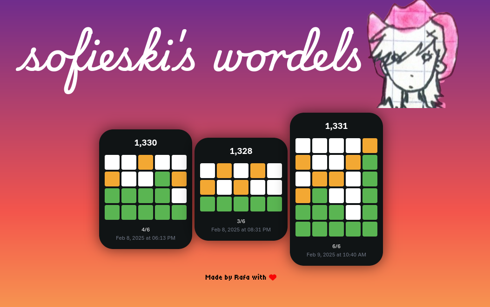

Hey there! This is a very small app I built for my friend Sofia because I love all my friends :)

She sends the daily Wordle solution like the grandma she is, so I made a site that keeps track of all of them in a fun way so she can keep record.

###  🛠️ How It Works 

It uses a WhatsApp bot in the backend, which:

1. Finds messages sent by Sofia (it uses WWJS, so I must be logged in!)
2. Uses a regex to make sure they match the format of a Wordle solution
3. Collects the relevant solution and uploads it to a Supabase table

This frontend is subscribed to updates to said table, meaning that whenever she uploads a new solution, **it gets updated in real time!**

---

**Built by Rafa with ❤️**
